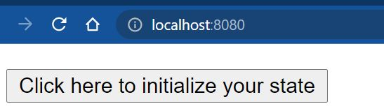
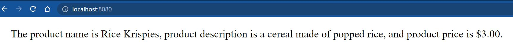

# wk12-react-intro

Use React.js functionality.  Use setState, object deconstruction, and string interpolation to create a string displayed in the browser.

# How to Run

When correctly implemented, you will see a button on the screen:

When you press on it, you will see the following text on the screen:

## Credit

MIT xPRO: Professional Certificate in Coding: Full Stack Development with MERN - September 2021
